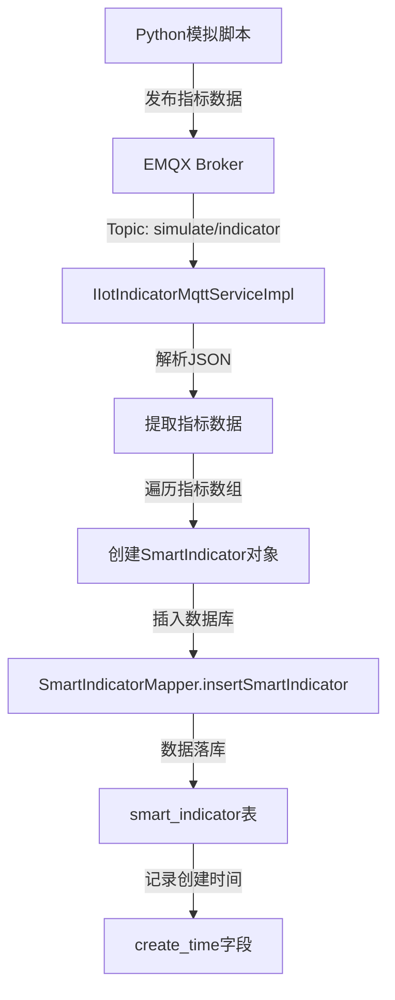
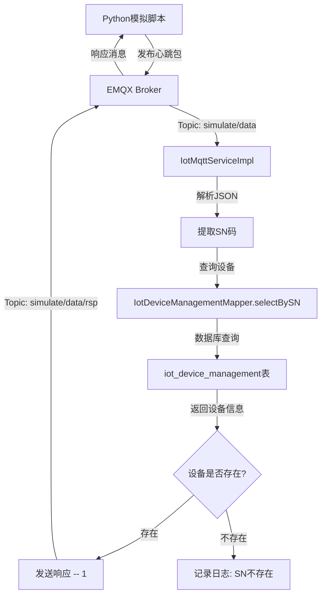

# 云平台-dev-note

- [x] 1、修改验证码的逻辑；
- [x] 2、替换登录页背景；
- [ ] 3、新增普通用户和菜单，用户能关联菜单；
- [x] 4、替换系统名称；
- [x] 5、实现设备管理功能；
- [x] 6、替换登录和退出的过度背景页颜色。
- [x] 7、替换首页的 icon
- [ ] 8、加载样式 Loading 修改

## 实现 MQTT 模块的操作

### 1. 宿主机构建 Broker

> EMQX 实现消息队列的功能，使用docker 开启对应的服务
>
> https://docs.emqx.com/zh/emqx/v5.8/getting-started/getting-started.html#emqx-%E5%BC%80%E6%BA%90%E7%89%88 [官网下载链接]

```bash
docker pull emqx/emqx:5.8.0
# 直接开启 docker 服务
# 生产
docker run -d --name emqx -p 1883:1883 -p 8083:8083 -p 8084:8084 -p 8883:8883 -p 18083:18083 emqx/emqx:latest
# 开发及测试
docker run -d --name emqx -p 1883:1883 -p 18083:18083 emqx/emqx:5.8.0
```

> 端口号区别，上面docker指令用于生产环境，下面开发测试足够

| 端口  | 上面命令是否暴露 | 作用                             | 何时需要              |
| ----- | ---------------- | -------------------------------- | --------------------- |
| 1883  | ✅               | MQTT TCP（最常用）               | 始终需要              |
| 8083  | ✅               | MQTT over WebSocket              | 前端要用 ws\:// 连接  |
| 8084  | ✅               | MQTT over WebSocket Secure (WSS) | 前端要用 wss\:// 连接 |
| 8883  | ✅               | MQTT over TLS                    | 设备端开 TLS 时       |
| 18083 | ✅               | HTTP Dashboard                   | 看指标、调试用        |

### 2. 本地连接测试

> 使用客户端MQTTX https://mqttx.app/zh/docs/downloading-and-installation [安装地址]

测试 topic -> simulation/data,test/topic

### 3. 依赖添加

> MQTT 依赖

```xml
<!-- 读取启动application.yml配置-->
<dependency>
    <groupId>org.springframework.boot</groupId>
    <artifactId>spring-boot-starter</artifactId>
</dependency>

<!-- Eclipse Paho MQTT Client（核心依赖，支持 EMQX 5.8.0） -->
<dependency>
    <groupId>org.eclipse.paho</groupId>
    <artifactId>org.eclipse.paho.client.mqttv3</artifactId>
    <version>1.2.5</version>
</dependency>
```

> application.yml 文件

```yml
mqtt:
  broker-url: tcp://localhost:1883 # emqx 实例地址
  client-id: ruoyi-mqtt-client-${random.uuid} # 随机的client-id
  username: admin
  password: public
  qos: 1 # 服务质量（0: 最多一次, 1: 至少一次, 2: 恰好一次）
  keep-alive: 60 # 单位 s
  clean-session: true # 清理会话
  timeout: 30000 # 连接超时 ms
```

> 配置mqtt-config

```java

```

### 4.设备传回消息

> 使用json模拟 ---- 将device_alarm的数据使用json序列化和反序列化进行数据的读取以及数据JSON格式的发送

```json
// mock data
{
  "deviceId": "monitor-sensor-001",
  "timestamp": "2025-09-15T10:00:00Z",
  "type": "environmental",
  "data": {
    "temperature": 25.5,
    "humidity": 60.2,
    "pressure": 1013.25,
    "batteryLevel": 85
  },
  "status": "normal",
  "alert": null
}
```

sumilate-data 【暂时ruoyi-device-alarm】 -- 定时【 Sentinal任务模块 】对到手的数据落库 --- 其他服务查询

Q:

1. 是否需要使用生成代码构建一个模块 【solve】-- 直接构建一个模拟模块，前端代码模拟不需要
2. 模拟数据落库 -- 两个选项 1，直接到对应的设备告警模块 2，定时任务模块【solve】 -- 定时任务模块
3. 模拟使用mqtt的依赖位置 -- 1，总的pom 2，单独的测试模块添加 3，在commen 【这个模块没有任何依赖】

## 分步解决今天下午进程 9.16

1.  构建模拟模块 `ruoyi-sumlate` 模块 -- 配置六个请求的消息
    - [x] 先删除之前的模块【ruoyi-alarm】
    - [x] 构建新模块【ruoyi-common-mqtt】
    - [x] 依赖的配置
    - [x] 配置 `mqtt-config`
    - [ ] 构建六个请求的模拟数据【优先模拟一个数据的test实现】
    - [ ] 消息接收落库操作【直接使用自带的 Quartz 注解】【在模块中间实现对应的功能】

> Q：
>
> 实现模拟发送信息的模块使用 -- common 模块将对应的信息配置完毕能调用mqttClientService的service来实现public, 但是调试该在哪里使用这个service的调用 -- modules 中间的Controller中间测试的话需要权限认证没有办法实现测试，如果common下面测试就没有启动类来自动装配的Bean,所有的模块基本没有预留测试的test模块，是否要创建一个新的simulate的模块，这样启动类就会过多，有没有比较好的方法来进行测试

## 上午进程 9.17

> 上午需求处理
>
> 1. mqtt 模块完善 -- 构建不同的service--publish / subscribe [在存在接口方法中间直接调用实现测试]
> 2. SQL文件的查看，检查对应的SQL是否存在设计问题

1. 实现mqtt模拟及测试
   - [x] 构建不同的service--publish / subscribe
   - [x] 接口方法中间直接调用实现测试【使用非解耦合方式解决但是不够模块化开发】

2. 校验SQL
   - [ ] 检查对应的SQL是否存在设计问题

> 最终解决方案 == 将模块全部放进去，没有实现解耦

## 下午进程 9.17

> 将上午实现的功能尝试解耦和，之后将这个模块构建为通用模块实现
>
> 1. 将功能发布 --- 消息消费的流程走通，尝试使用模拟python脚本实现数据的模拟之后操作数据传递到后眼数据上面
> 2. 尝试定时任务将得到的数据落库
> 3. SQL的教研

mention -> 使用mqttClient的时候在初始化的时候在参数callback调用实现的IMqttCallback的时候，在这个创建的链接中间只要通过订阅topic之后就会自动对消息进行消费操作，不需要手动调用对应的consumer方法。

Q

1. 在IMqttServiceImpl中间的@PreDestory注解的删除操作是否需要使用public指定能手动将这个连接断开
2. 还有一种方法 === 实现一个注解 @MqttTopic("DemoTopic") 之后将这个代码实现解耦操作，主要实现Mqtt 连接 + 订阅 + 路由【方案没有还没验证】

```java
@MqttTopic("device/+/status")
public void onDeviceStatus(String topic, byte[] payload) { ... }
```

## 9.18上午进程

1. 设计mqtt最终处理方案

   ```json
   --- 模拟方案
   使用 python 模拟数据发送
   -- 脚本一（注册包）
   	-- 心跳包，每40秒发送一次，需要回复
   -- 脚本二 （数据包）
   	-- 不需要回复，收到消息处理之后直接落库
   ```

> 上午仅仅处理模拟数据使用py脚本实现，下午

## 9.18下午进程

> mqtt 方案 -- 模拟方案 -- 上线方案
>
> 主要是将流程图绘制之后将代码实现方案进行梳理

1. mqtt 实现方案
   - [x] 模拟方案(使用json数据构建mock数据) === 基本实现
   - [ ] 上线方案(使用原生的消息处理，需要将数据进行处理)

2. 梳理代码实现逻辑
   - [ ] 编码解码实现
   - [x] 返回消息模拟操作

Q:

1. 消息丢失问题，就是消息在模拟脚本上传的时候中途停止，中间的消息可能会丢失导致数据可能最后的不一致，例子 == 就是如果设备下线了这时候的数据没有到达后端就结束了进程所以消息就会在到达之前的部分全部丢失需要将数据确保最后一条消息（设备的遗嘱消息是否设置）
2. 实现数据的处理操作主要的内容是对上传的数据的处理实现 【上线方案还是需要时间进行修改】
3. 架构设计问题，该如何将设计监听在服务中间开始的位置，以及实现监听服务的对齐

```json
{
  "deviceName": "\u6a21\u62df\u8bbe\u5907-5922",
  "sn": "SN655392",
  "description": "\u6a21\u62df\u8bbe\u5907\u6570\u636e",
  "location": "\u4f4d\u7f6e-B\u533a",
  "specifications": "\u89c4\u683c-4\u578b",
  "model": "\u578b\u53f7-Z52",
  "department": "\u90e8\u95e8-\u8d28\u68c0",
  "timestamp": "2025-09-18T11:42:05.248316",
  "creator": "caius"
}
```

## 上午进程9.19

> 实现昨天残留问题，将模拟方案和上线方案搞定

1. 方案定稿
   - [x] 模拟方案
   - [ ] 上线方案【待定】

```json
-- 上线稳妥方案
- 订阅之后就不断开订阅，持续接收消息
- 客户端离线后，emqx会缓存未送达的消息
	- clean_session = false (MQTT3)
	- session_expiry_intervel > 0 (MQTT5)
- QoS >= 1 确保消息至少送达一次，避免 Broker 收到就丢失数据
- clientId 固定, 持久会话是基于 clientID的所以要保证连接的服务是使用同一个服务
```

> 方案优化
>
> - 实现解耦，直接在Config中间返回MqttClient实现回调，之后在@Autowired进行数据的注入之后操作，直接使用setCallBack(new CallBack(){ /_ 实现的三个函数_/}) 实现callback的解耦【最有优越感的时刻】

## 下午进程9.19

> 实现早上优化代码操作的技术方案

## 9.20 上午进程

> 首页界面处理方案，实现设计UI的前端登录界面的设计实现

## 上午进程9.22

> 将首页界面进行修改，暂时实现预定的首页界面。主要修改位置在`login.vue`实现

## 下午进程9.22

> 界面输入框样式优化，logo优化，介绍字体修改，ngork 构建测试接口
>
> 修改首页界面（即将结束） ==> 首页界面代码未上传码仓

## 9.23 上午进程

> 处理dev分支的mqtt构建实现（同步代码的效果实现）
>
> 首页界面的视频播放效果(只播放一次，未加载视频默认显示第一帧，播放完毕显示最后一帧)

## 9.23 下午进程

> 思考==如何构建一个在auth构建的效果，实现登录不同的公司的普通用户查看不同的首页大屏的效果
>
> 前端的普通用户首页显示

- 使用多租户模式将不同的请求进行构建

可能要考虑给用户添加一个tenantId,之后对不同的用户实现分离，请求的时候在请求的路径上面添加用户的tenantId,请求到的路径显示不同的首页，还有要实现一个全局的启动类就是全局保留返回用户的消息（将用户数据保留在）

> 采用多租户模式 === tenantId 用户添加一个属性
>
> - auth -- 校验 JWT
> - common-security -- 角色权限校验
> - @RequiresPermissions/@RequiresRoles -- 注解实现校验方案
> - ruoyi-common-datascope -- 用户数据查询的属性整合
> - gateway 没有处理操作 -- 添加一个校验逻辑，是否在请求中间添加 tenanId
> - isAdmin == 校验直接通过不需要校验直接返回首页

```bash
docker stop emqx

docker start emqx

docker ps -a
```

## 上午进程 9.24

不要使用外键--不到万不得已不使用外键，在业务代码逻辑实现对应的关联尽量不是用外键连接

> 1. 上传代码到 dev 分支
>    - [x] login.vue -- 上传首页代码
>    - [x] mqtt 的服务修改 --- 从原来的 alert -> indicator 模块切换
>    - [ ] dev-分支 docker 配置处理【取消】
>    - [ ] 处理 mqtt 模块模拟实现功能 -- 主要数据落库操作【实现指标数据模拟落库】【逻辑修改】

上传login.vue【登录界面】 + 修改 mqtt 服务配置模块

```text
校验方式 -- 心跳包【simulate/data】数据存活 -- 数据包【simulate/indcator】指标
```

> Q -- 如何实现校验设备是否下线，员工登录处理还是使用mqtt进行校验，如果没有监听就处理？【末尾处理数据问题】



### 数据心跳



### Inticator 指标处理


## 下午进程 9.24

> 将配置文件进行区别，将本地的配置复制一份以及修改之后的dev分支进行配置修改，实现在本地运行dev分支
>
> 配置文件替换位置在 `dev-proj /conf/` 【上传配置】文件夹下面
>
> - 对普通用户的首页进行设计构建

## 9.25 全天进程

> 主要两点 -- 普通用户首页 -- 多租户扩展规划

执行优先级【从上到下】

- [ ] 普通用户首页
  - [x] 左导航栏【12.05实现完毕】
  - [x] 上导航栏
  - [x] 设备消息统计
  - [x] 物联网引导
  - [ ] 地图模块
- [ ] 多租户扩展规划【延迟】

## 9.26 全天进程

> 处理昨天剩余模块

注意 -- docker 配置使用原来项目的实现

- [x] 普通用户首页
  - [x] 告警信息模块

  - [x] 实时检测信息【开始准备】
  - [x] 地图模块【加入API考虑 java/js实现】

集成前端的amap的设置需要下载的依赖

```cmd
# 下载高德地图的js API加载器
npm install @amap/amap-jsapi-loader --save
```

- 创建Amap对象
- 对应的 AMapIcon

## 9.28 全天进程

```js
// 实现高德地图切换显示地图样式
    var map = new AMap.Map('container', {
        center: [116.397428, 39.90923],
        layers: [new AMap.TileLayer.Satellite()],
        zoom: 13
    });
主要参数是 layers 样式选择
# AMap.createDefaultLayer()//高德默认标准图层,直接使用标准图层可以省略
# AMap.TileLayer.Traffic({ zIndex: 10,zooms: [7, 22],}) // 使用实时路况地图样式
# AMap.TileLayer.Satellite()//高德地图的卫星图层显示
# AMap.TileLayer.Satellite(), AMap.TileLayer.RoadNet() // 卫星 + 路网
```

> 切换amap的显示样式，之后的大屏界面显示需要使用卫星地图样式实现

下午主要工作 --- 实现多租户操作的技术方案【初步构建】 -- 需要对可行性进行优化判断

## 9.29全天进程

> 定下多租户的技术方案，准备明天的首页界面的icon优化

## 9.30全天进程【pre】

> 对应的普通首页界面的svg图片添加，后面实现的多租户技术方案以及落地的实现指导

## 10.9全天进程

> KCloud-platform-IoT【参考项目】
>
> 数据大屏实现【首页大屏实现以及跳转的主要点击功能实现】

对应的技术实现方案操作 -- 不同的用户获取的数据操作大屏的界面的uri通过对应的用户的tenantId对应的数据进行数据的校验之后返回数据大屏对应的uri实现点击查看对应的数据大屏【前提是对应的租户对数据进行了购买操作】

router --- 界面screen --- 对应的数据大屏界面实现

#### 前端主要功能实现

- [x] 用户首页界面
- [x] 首页数据大屏界面【准备请求界面的逻辑中...下午开始处理一个界面】
- [ ] 气象水文驾驶舱
- [ ] 智慧地质
- [ ] 智慧城市
- [ ] 智慧农情
- [ ] 空气气体
- [ ] 水环境驾驶舱

> 大屏实现构建顺序 请求转发router--path://screen,之后添加权限校验之后点击链接进行大屏的访问操作。实现大屏的访问界面构建优先级 top1

## 10.10进程

> 升级服务器到16g --- 将首页大屏构建完毕

- [x] 首页数据大屏界面【构建完毕 -- 一些请求动态数据为处理】
- [ ] 气象水文驾驶舱【开发中】
- [ ] 智慧地质
- [ ] 智慧城市
- [ ] 智慧农情
- [ ] 空气气体
- [ ] 水环境驾驶舱
